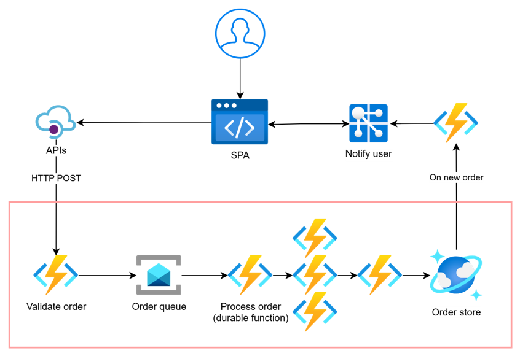

# JTE2024 - Event-driven Serverless Apps demo

A demo for an event-driven e-commerce api implemented using:
- Azure Functions: order validation
- Durable Functions: order processing
- Service Bus: communication between order validation and order processing
- Cosmos DB for NoSQL: storing processed orders
- Application Insights: observability




## Order validation function

### Sample test payload

```json
{
    "items": [
        {
            "productId": 1,
            "quantity": 1
        },
        {
            "productId": 2,
            "quantity": 5
        }
    ]
}
```

### Sample response

```json
{
  "id": "71182b45-bde4-4d8c-97f6-9e3f1d652c0f",
  "createdAt": "2024-04-17T09:59:50.259Z",
  "items": [
    {
      "productId": 1,
      "quantity": 1
    },
    {
      "productId": 2,
      "quantity": 5
    }
  ]
}
```
